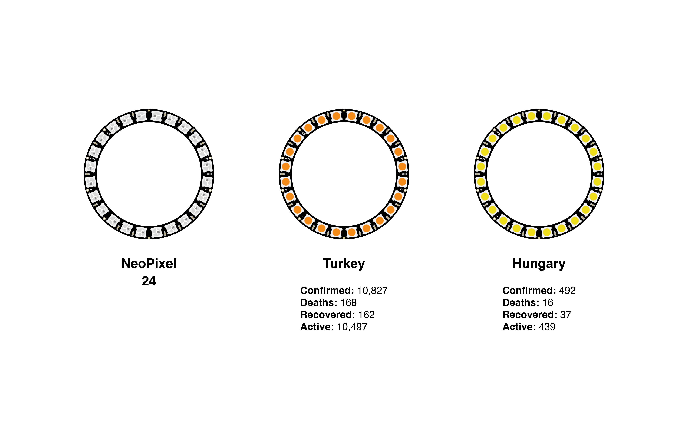
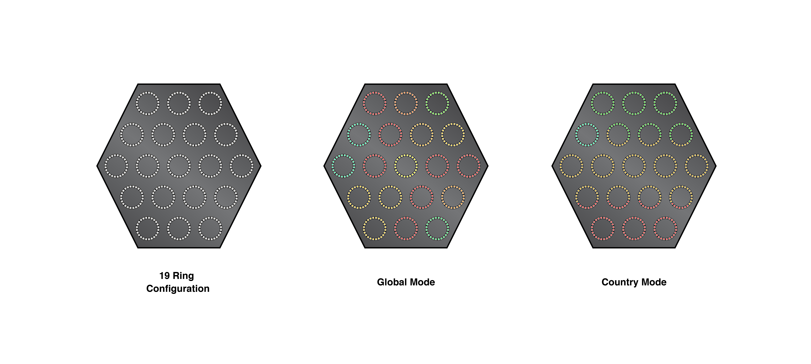
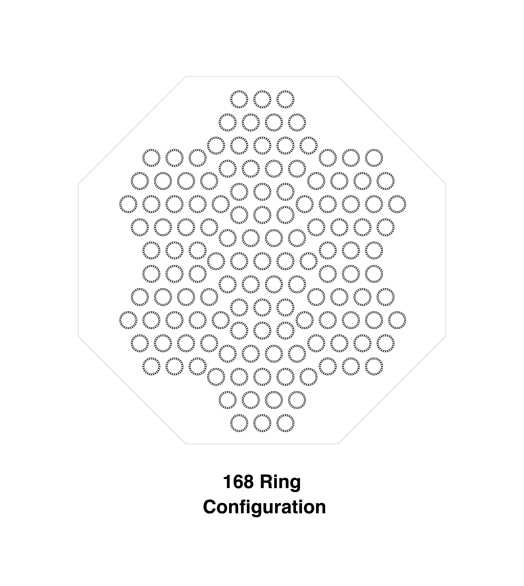

# COVID-19 Visualizer

## Overview

A visualizer for the **COVID-19** spread using NeoPixel Rings.

## Requirements

- Acrylic board, cut to a hexagon, black, 448mm * 448mm * 20mm, sides: 224mm
- NeoPixel Ring 24 * 19
- 74AHCT125 Quad Level-Shifter
- Raspberry Pi 3 B+
- Power supply 5V Min: 10A / Max: 28A
- QR code directing to the web server
- Wiring

## Specifications

### Hardware

- **Pi:** 85.6mm * 56.5mm * 17mm
- **Ring:** D: 65.6mm t: 6.7mm
- **Total size:** 448mm * 448mm * 43.7mm

- **Ring margins:** 20mm
- **Side margins:** 20mm

### Software

- Custom Python script using [coronavirus-tracker-api](https://github.com/ExpDev07/coronavirus-tracker-api) with [COVID19Py](https://github.com/Kamaropoulos/COVID19Py) wrapper.
- Script will be responsible for getting and parsing the data from the API as well as sending the required code to the rings.
- Web server (potentially running on Python as well) for country select and further information.

### Design

***

***

**3D:** https://www.tinkercad.com/things/85oikfL3Lkf-exquisite-juttuli/edit?sharecode=qTap-OJepxxEpqBT7iMIQngzNuERziIqP4K2FfYB1gk

## Sources

- API Data Source 1: https://github.com/CSSEGISandData/COVID-19
- API Data Source 2: https://www.csbs.org/information-covid-19-coronavirus
- API: https://github.com/ExpDev07/coronavirus-tracker-api
- Python Wrapper: https://github.com/Kamaropoulos/COVID19Py
- NeoPixel Python Library: https://github.com/adafruit/Adafruit_CircuitPython_NeoPixel

## Sample Response from API
~~~~json
{
    "location": {
    "id": 39,
    "country": "Norway",
    "country_code": "NO",
    "country_population": 5009150,
    "province": "",
    "county": "",
    "last_updated": "2020-03-21T06:59:11.315422Z",
    "coordinates": { },
    "latest": { },
    "timelines": {
        "confirmed": {
            "latest": 1463,
            "timeline": {
                "2020-03-16T00:00:00Z": 1333,
                "2020-03-17T00:00:00Z": 1463
            }
        },
        "deaths": { },
        "recovered": { }
        }
    }
}
~~~~